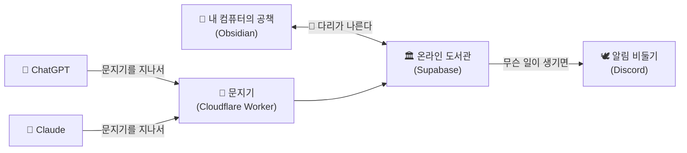
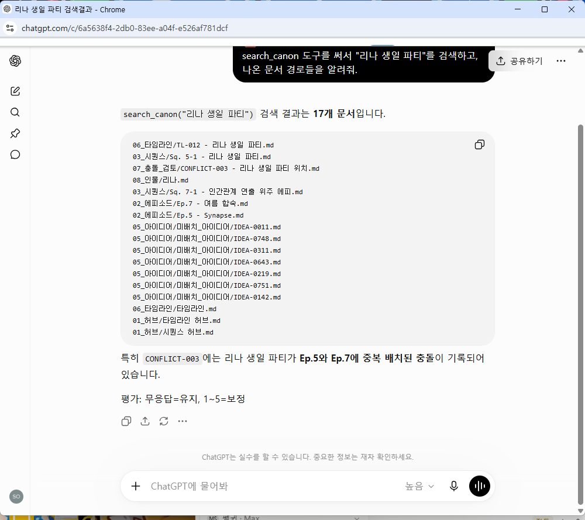
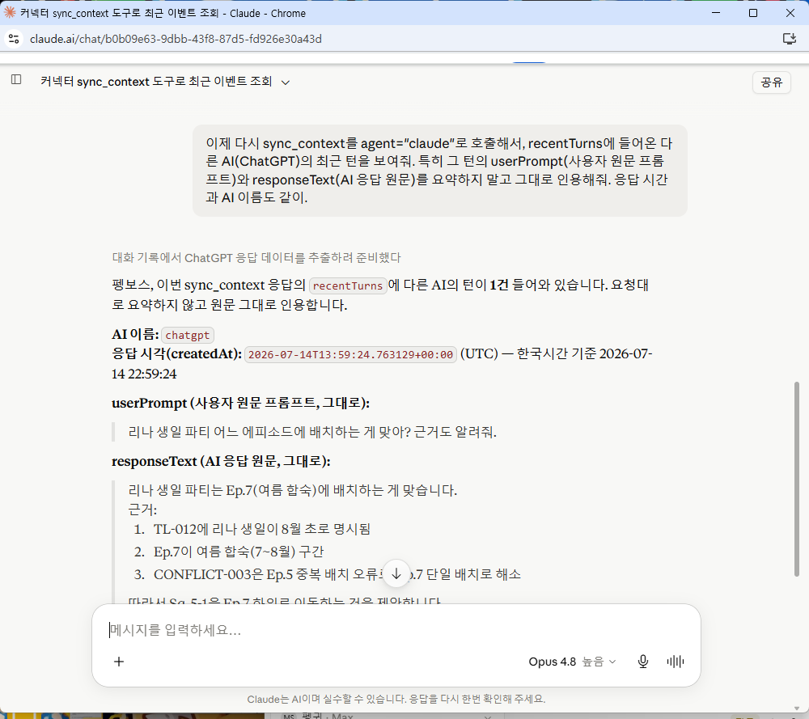
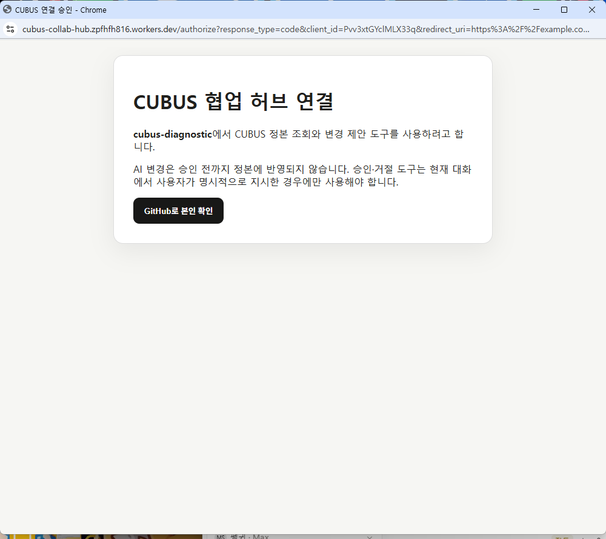
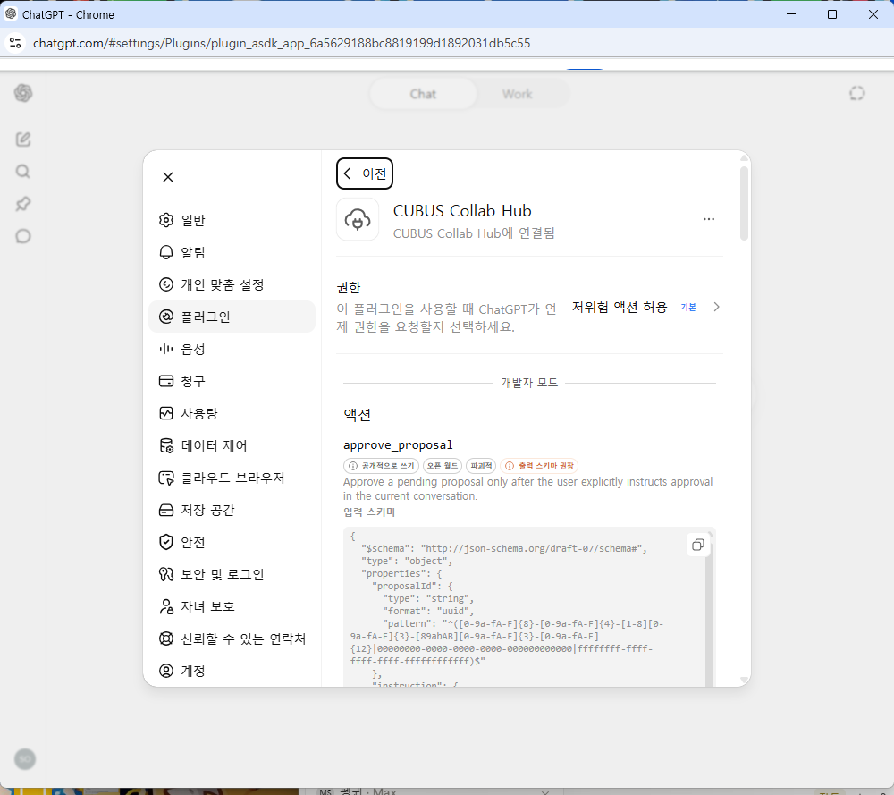
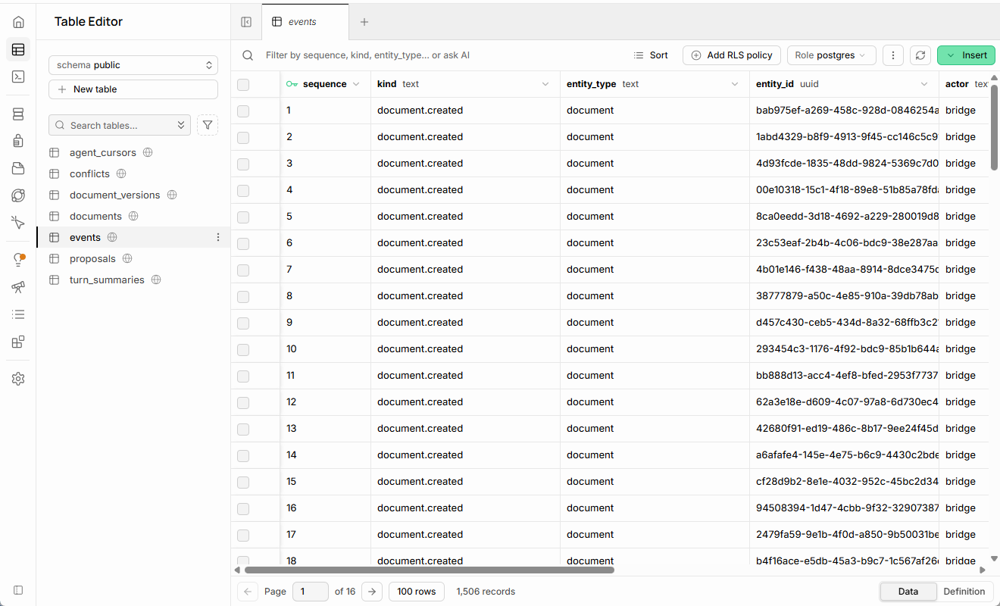
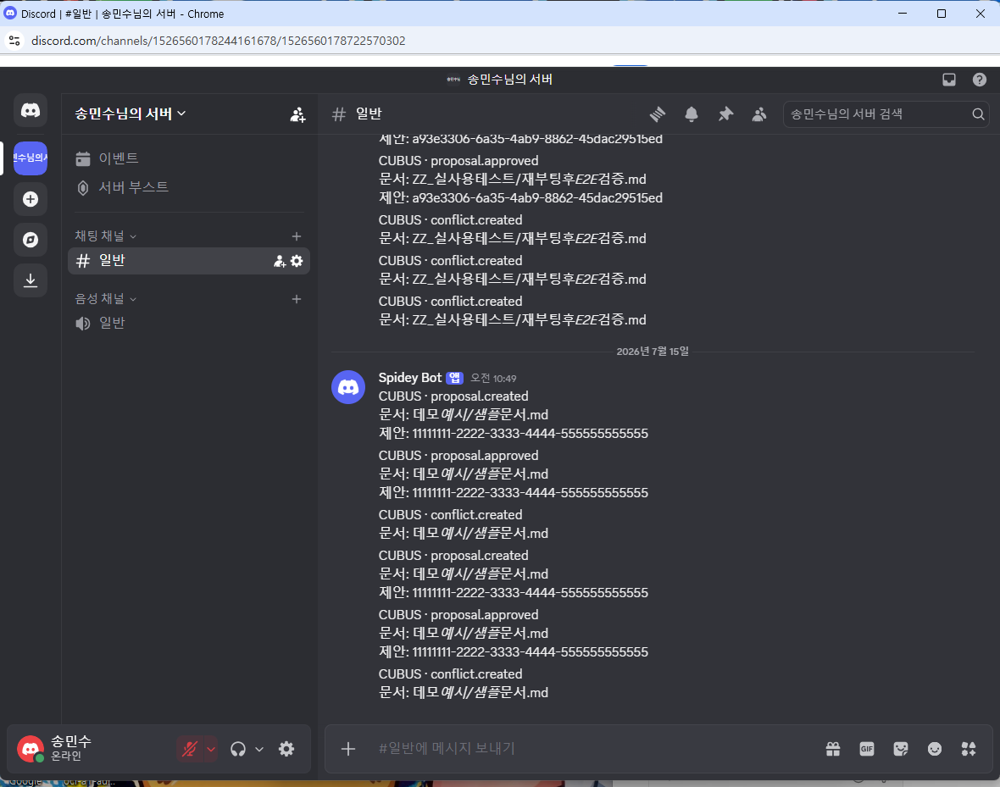

# CUBUS Collaboration Hub

> **한 줄 소개**: 이야기 공책을 보관하는 **온라인 도서관**이에요. AI 친구 둘(ChatGPT, Claude)이 같은 도서관을 보면서 주인을 도와줘요.

## 🤔 이게 뭐예요?

주인님은 **CUBUS**라는 이야기를 쓰고 있어요. 이야기 공책(문서)이 1,400권이 넘어요!

예전에는 AI 친구에게 이야기를 보여주려면 공책을 매번 복사해서 갖다줘야 했어요. 너무 힘들었죠. 그래서 **공책을 전부 온라인 도서관에 넣어두고, AI 친구들이 직접 와서 읽게** 만들었어요. 그게 바로 이 프로젝트예요.



## 📸 실제로 이렇게 써요

말로만 설명하면 어려우니, 진짜 화면을 보여드릴게요.

### 1️⃣ ChatGPT가 도서관에서 이야기를 찾아요

ChatGPT에게 "리나 생일 파티 찾아줘"라고 했더니, **직접 도서관(CUBUS 허브)에 가서** 관련 공책 17권을 찾아왔어요. `search_canon`이라는 도구를 쓴 거예요.



### 2️⃣ Claude가 ChatGPT의 말을 "그대로" 읽어요

Claude에게 "ChatGPT가 방금 뭐라고 했어?"라고 물었더니, 요약이 아니라 **누가·언제·무엇을 물었고 어떻게 답했는지 토씨 하나 안 빼고** 그대로 가져왔어요. AI 친구끼리 같은 기억을 공유하는 거예요.



### 3️⃣ 문 앞에서 "너 진짜 주인 맞아?" 확인해요

아무나 도서관에 못 들어와요. AI 친구를 연결할 때 GitHub로 주인인지 한 번 확인해요. (주인 계정 딱 하나만 통과!)



### 4️⃣ 연결되면 도구들이 준비돼요

연결이 끝나면 AI가 쓸 수 있는 도구들이 나타나요. 예를 들어 `approve_proposal`(쪽지 승인하기) 같은 것들이요.



### 5️⃣ 도서관(슈퍼베이스)에는 모든 게 차곡차곡 쌓여요

공책이 새로 들어오거나, 쪽지가 생기거나, 충돌이 나면 — **무슨 일이 있었는지 전부 "사건 기록장"에 순서대로 적혀요.** 아래는 진짜 도서관 뒷방(Supabase) 화면인데, 지금까지 **1,506건**의 사건이 기록돼 있어요. 왼쪽에는 공책(`documents`), 쪽지(`proposals`), 사건 기록장(`events`), 충돌(`conflicts`) 같은 서랍들이 보여요.



> 💡 이 "사건 기록장" 덕분에 AI 친구가 나중에 접속해도 *"내가 없는 동안 무슨 일이 있었지?"*를 순서대로 따라 읽을 수 있어요.

### 6️⃣ 중요한 일이 생기면 🕊️ 알림 비둘기가 디스코드로 알려줘요

쪽지가 새로 생기거나(`proposal.created`), 주인이 승인하거나(`proposal.approved`), 충돌이 나면(`conflict.created`) — 곧바로 디스코드에 메시지가 떠요. 그래서 도서관을 계속 안 보고 있어도 무슨 일이 생겼는지 바로 알 수 있어요.



> 🔒 알림에는 **무슨 일이 있었는지(사건 종류·공책 이름·쪽지 번호)만** 적혀요. 이야기 내용 자체는 절대 비둘기가 물고 다니지 않아요.

## 👥 등장인물

| 등장인물 | 진짜 이름 | 하는 일 |
|---|---|---|
| 🏛️ 도서관 | Supabase | 진짜 공책(정본)을 전부 보관해요 |
| 💂 문지기 | Cloudflare Worker | "누구세요?" 하고 확인해요. 주인(GitHub 계정)이 허락한 손님만 들여보내요 |
| 🌉 다리 | Bridge | 내 컴퓨터의 공책과 도서관 공책이 항상 똑같도록 계속 나르고 살펴요 |
| 🤖 AI 친구들 | ChatGPT, Claude | 도서관에서 이야기를 읽고, 좋은 생각이 나면 **쪽지(제안)**를 남겨요 |
| 🕊️ 알림 비둘기 | Discord | "새 쪽지가 왔어요!" 하고 주인에게 알려줘요 |

## 📏 가장 중요한 규칙 3가지

1. **AI는 공책에 직접 낙서할 수 없어요.** ✍️
   AI 친구가 "이 부분 이렇게 고치면 어때요?" 하고 싶으면, 공책을 고치는 게 아니라 **쪽지(proposal)**를 써서 제출해요.

2. **주인이 "좋아!"라고 해야만 공책이 바뀌어요.** ✅
   쪽지를 읽어본 주인이 승인하면 그때서야 도서관 사서가 공책을 고쳐줘요. 승인 안 하면 공책은 그대로예요.

3. **오래된 공책으로 덮어쓰면 안 돼요.** ⚠️
   누가 옛날 버전 공책을 들고 와서 "이걸로 바꿔주세요" 하면, 도서관은 바꾸지 않고 **충돌 상자**에 넣어요. 그러면 주인이 나중에 어느 쪽이 맞는지 정해요. 그래서 열심히 쓴 이야기가 실수로 사라지는 일이 없어요.

또 하나! AI 친구들은 대화가 끝나면 **"주인이 이렇게 물어봤고, 나는 이렇게 대답했어"를 요약하지 않고 그대로** 기록해요. 그래서 ChatGPT가 한 말을 Claude가 토씨 하나 안 빠뜨리고 읽을 수 있어요.

## 📂 폴더 안내

| 폴더 | 안에 든 것 |
|---|---|
| `packages/worker` | 문지기 코드 (누군지 확인하고, AI 친구용 도구를 빌려줘요) |
| `packages/bridge` | 다리 코드 (공책 나르기, 똑같은지 검사하기) |
| `packages/shared` | 문지기와 다리가 함께 쓰는 약속(규칙) 모음 |
| `supabase/migrations` | 도서관 책장 설계도 |
| `openapi` | ChatGPT에게 주는 사용 설명서 |
| `docs` | 설치하는 법, 안전하게 쓰는 법 |

## 🔧 켜보고 싶다면 (어른용)

```powershell
npm install
npm run check
```

설치 순서는 [docs/setup.md](docs/setup.md)에 있어요.

## 🔒 비밀 지키기

- 이 저장소에는 **코드만** 있어요. CUBUS 이야기 원고, 설정, 비밀번호는 **절대** 여기에 올리지 않아요.
- 열쇠(비밀값)는 Wrangler Secret과 Windows 자격 증명 관리자라는 금고에만 넣어요.
- 알림 비둘기(Discord)는 "무슨 일이 있었는지"만 전하고, 이야기 내용은 절대 물고 다니지 않아요.
- 문지기는 주인의 GitHub 계정 딱 하나만 통과시켜요.

## 📜 라이선스

라이선스를 부여하지 않습니다. 소스는 공개 열람할 수 있지만 복제, 수정, 배포 또는 상업적 이용 권한은 별도로 허가되지 않습니다.
